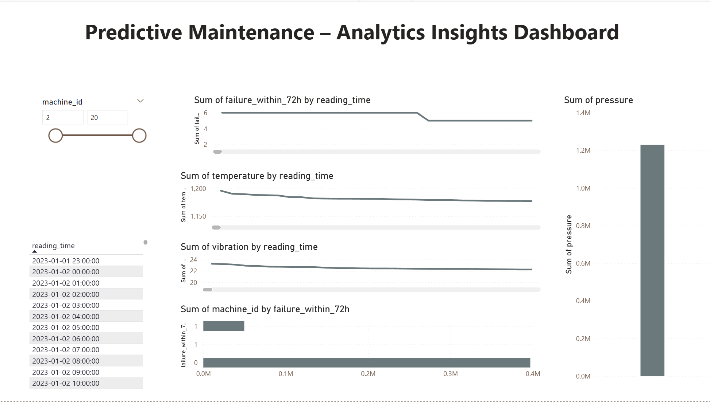

# Predictive Maintenance using Python, Azure SQL & Power BI  
**Completed Jan–Mar 2023** | Simulated IoT data, Machine Learning, Cloud SQL, and Interactive Dashboards

This project builds a complete predictive maintenance pipeline using:  
**Python → Azure SQL → Machine Learning → Power BI Dashboards.**

The goal is to predict equipment failures **72 hours in advance** using sensor data.

---

## Documentation (Completed 2023)

### **Project Proposal**
- [PDF](docs/Predictive_Maintenance_Project_Proposal.pdf)
- [DOCX](docs/Predictive_Maintenance_Project_Proposal.docx)

### **Project Plan – 8 Week Timeline**
- [PDF](docs/Predictive_Maintenance_Project_Plan.pdf)
- [DOCX](docs/Predictive_Maintenance_Project_Plan.docx)

---

## Repository Structure

docs/ → Project proposal, project plan, documentation
data/ → Simulated IoT sensor data
notebooks/ → Jupyter notebooks (Week 1–5 pipeline)
src/ → Python scripts (simulation, features, training)
sql/ → SQL schema & queries
figures/ → Dashboard screenshots & visual outputs
models/ → Saved trained ML model (.pkl)
dashboards/ → Power BI files (.pbix)

---

## 4. Model Performance

Goal: predict whether a machine will fail within the next **72 hours** (`failure_within_72h = 1`).

### **4.1 Model Comparison**

| Model               | Accuracy | Precision | Recall | F1-score | ROC–AUC |
|---------------------|----------|-----------|--------|----------|---------|
| Logistic Regression | 0.991    | 0.932     | 0.987  | 0.959    | **0.999** |
| Gradient Boosting   | 0.996    | 0.993     | 0.967  | 0.980    | 0.999   |
| Random Forest       | 0.996    | 1.000     | 0.959  | 0.979    | 0.998   |

> **Logistic Regression** was selected as the primary model due to its high ROC–AUC, fast runtime, and interpretability.

### **4.2 Saved Artifacts**
- Best model: `models/best_model.pkl`
- Metrics log: `models/model_metrics.json`

---

## 5. Azure SQL Integration (Week 4)

Week 4 deployed the engineered dataset to **Azure SQL Database**.

### **Key Actions**
- Created Azure SQL server: `goitom-pm-sqlserver`
- Created DB: `predictive_maintenance_db`
- Allowed secure access via firewall + SQL authentication
- Created `SensorFeatures` table
- Implemented secure ingestion with `pyodbc` + environment variables
- Verified rows using Azure Query Editor

Notebook:  
`notebooks/04_azure_sql_integration.ipynb`

---

## 6. Power BI Dashboards (Week 5)

Week 5 connected Azure SQL → Power BI using **DirectQuery** to build live dashboards.

### **Page 1 – Predictive Maintenance (Executive KPI Dashboard)**  
Includes:
- Total Sensor Readings  
- Failures Detected  
- Model Accuracy  
- Precision  
- Recall  
- Machine ID Slicer  
- Failure Trend over Time  

### **Page 2 – Analytics Dashboard: Predictive Maintenance Insights**  
Includes:
- Machine ID slicer  
- Date/time slicer  
- Failure trend  
- Temperature trend  
- Vibration trend  
- Pressure trend  
- Machine-level failure risk (bar chart)  

**Power BI file:**  
`dashboards/predictive_maintenance_dashboard.pbix`

---

# Dashboard Screenshots (Week 5)

### KPI Dashboard  
Shows high-level model performance and summary metrics.

### Analytics Dashboard – Predictive Maintenance Insights  
Shows detailed sensor trends and machine-level risk.

---

## How to Reproduce

1. Create Azure SQL DB: `predictive_maintenance_db`
2. Run: `notebooks/04_azure_sql_integration.ipynb`
3. Open Power BI:
   - Load `dashboards/predictive_maintenance_dashboard.pbix`
   - Update connection string if needed

---

## Project Completed  
This end-to-end workflow demonstrates:

- IoT data simulation  
- Feature engineering  
- Machine learning modeling  
- Cloud SQL deployment (Azure SQL)  
- Interactive dashboards (Power BI)  
- Real-world predictive maintenance pipeline  

Perfect for:
✔ GitHub portfolio  
✔ Data Science roles  
✔ ML Engineering roles  
✔ SQL/Cloud/Power BI positions  

---
